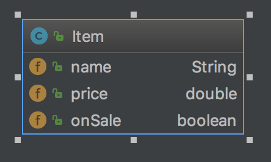
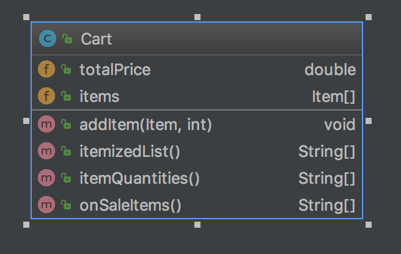

# tdd-shopping-cart

You have been hired as a developer at Ali Snobba - a snobby Asian online store where customers purchase high-end merchandise like Louis Vuitton handbags and Rolex watches.

Your job is to implement a shopping cart that stores items while customers are in the process of ordering. Since Ali Snobba is a small company with only one server, you don't need to store the items in Redis or a database - you can keep them in an array in memory.

You also don't need to worry about authentication or session tracking. You can assume that Ali Snobba's infrastructure will create a new Docker container with a instance of node for each active user.

## API specifications

A shopping cart `Item` should have the following model:



The shopping `Cart` should have the following model:



`addItem()` should take two parameters:

1. An `Item` Object
1. An integer `quantity`

`itemQuantities()` should return an array with one String for each type of item in the cart in the following format:

```JavaScript
[
    'Handbag - x2', 
    'Watch - x4'
]
``` 

`itemizedList()` should return an array with one String for each item in the cart in the following format:

```JavaScript
[
    'Handbag x1 - $500.00', 
    'Watch x2 - $40,000.00'
]
``` 

`onSaleItems()` should return an array with on String for each item in the cart marked as `onSale` in the following format:

```JavaScript
[
    'Handbag x1 - $250.00', 
    'Watch x2 - $20,000.00'
]
```

## TODO

As a developer, your task is to implement the following user story, following the TDD workflow:

- Write (failing) tests before writing any code
- Only write code in response to failing test
- Make tests pass with simplest code possible
- After getting each test to pass, refactor your code and tests to be as concise as possible

## Instructions

***Be sure to fork:***


***then Clone:***


***this repository!***

When you are finished with the exercise, [commit](https://www.atlassian.com/git/tutorials/saving-changes) and [push](https://www.atlassian.com/git/tutorials/syncing#git-push) your work!

You will know you have forked and pushed properly if you see your work in Github under your github account:


***not gSchool:***


## User Story:

- As a shopper
- I want to have a shopping cart
- So that I can store items until I am ready to checkout

## Acceptance Criteria:

1. Given that I visit the site, when I begin shopping, then I expect my cart to be empty.
1. Given I have an empty cart, when I add an Item, then I expect to see `totalPrice` reflect the sum of all the Items in my cart, times the quantities of each item.
1. Given I have an empty cart, when I add more than one of an item, then I expect `itemQuantities()` to show the number of items I have added.
1. Given I have an empty cart, when I add items, then I expect `itemizedList()` reflect the items I have added along with their price and quantity.
1. Given I have an empty cart, when I add more than one of an item, then I expect `totalPrice` to reflect both the item price and quantity.
1. Given I have a cart with items that are not on sale, when I add items that are on sale, I expect `onSaleItems()` to include only the items on sale.

## Tips

- Use [es6 getters](https://developer.mozilla.org/en-US/docs/Web/JavaScript/Reference/Functions/get) to simpliify your task.
- Use [es6 template litterals](https://developer.mozilla.org/en-US/docs/Web/JavaScript/Reference/Template_literals) instead of String concatenation
- Use [map, filter, and reduce](https://danmartensen.svbtle.com/javascripts-map-reduce-and-filter) to avoid looping
